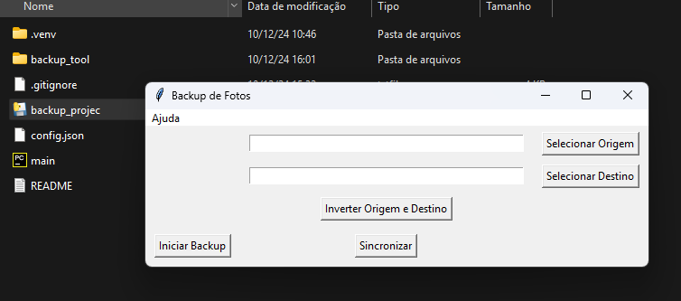

# Instruções para o Script de Backup

## Descrição

Este script realiza backups de diretórios que são selecionados pelo usuário utilizando o `rsync` do Cygwin. Ele permite selecionar diretórios de origem e destino, além de oferecer opções para sincronização.

O arquivo "backup_projec.exe" utiliza interface gráfica e roda em Windows.

## Tela

## Requisitos

Para executar o script de backup, você precisará do `rsync` instalado no seu sistema. O `rsync` é uma ferramenta de sincronização de arquivos e diretórios.

- **Python 3.x**: O script foi desenvolvido em Python e requer a versão 3.x instalada no seu sistema. Você pode baixar o Python em [python.org](https://www.python.org/downloads/).
- **Cygwin** com o `rsync` instalado. Você pode verificar a instalação do `rsync` executando `rsync --version` no terminal.

## Arquivo de Configuração

O script utiliza um arquivo JSON chamado `config.json` para armazenar informações sobre o caminho do `rsync`. O arquivo deve ter o seguinte formato:

`json`
{
    "rsync_path": "C:\\caminho\\para\\rsync.exe"
}

Substitua C:\\caminho\\para\\rsync.exe pelo caminho real do executável rsync.

## Executando o Script

Para executar o script, entre no diretório onde você baixou o script e utilize o seguinte comando no terminal PowerShell:
    
    cd D:\localDoScript\
    python main.py

## Verificação do `rsync`

O script tenta verificar se o `rsync` está instalado. Se não for encontrado, você verá uma mensagem informando que o `rsync` não foi encontrado.

## Instalando o `rsync`

Se você não tiver o `rsync` instalado, siga as instruções abaixo:

### Para Windows com Cygwin

1. **Instale o Cygwin**: Acesse [Cygwin](https://www.cygwin.com/) e siga as instruções de instalação.
2. **Durante a instalação**, certifique-se de incluir o pacote `rsync`:
   - Na tela de seleção de pacotes, busque por `rsync` e marque-o para instalação.

### Para Linux

1. Abra o terminal.
2. Execute o seguinte comando para instalar o `rsync`:

   sudo apt-get install rsync

ou, para distribuições baseadas em Red Hat:

    sudo yum install rsync

## Licença
Este projeto é de código aberto e está licenciado sob a Licença MIT.
